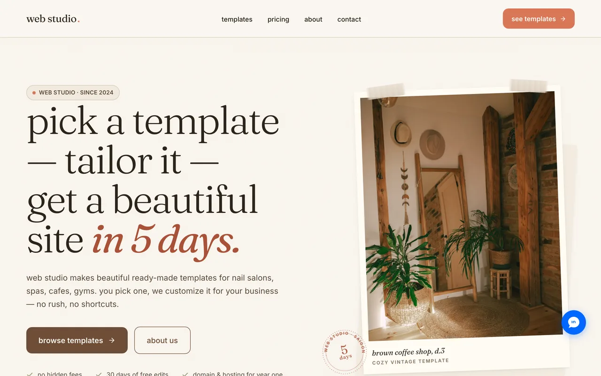
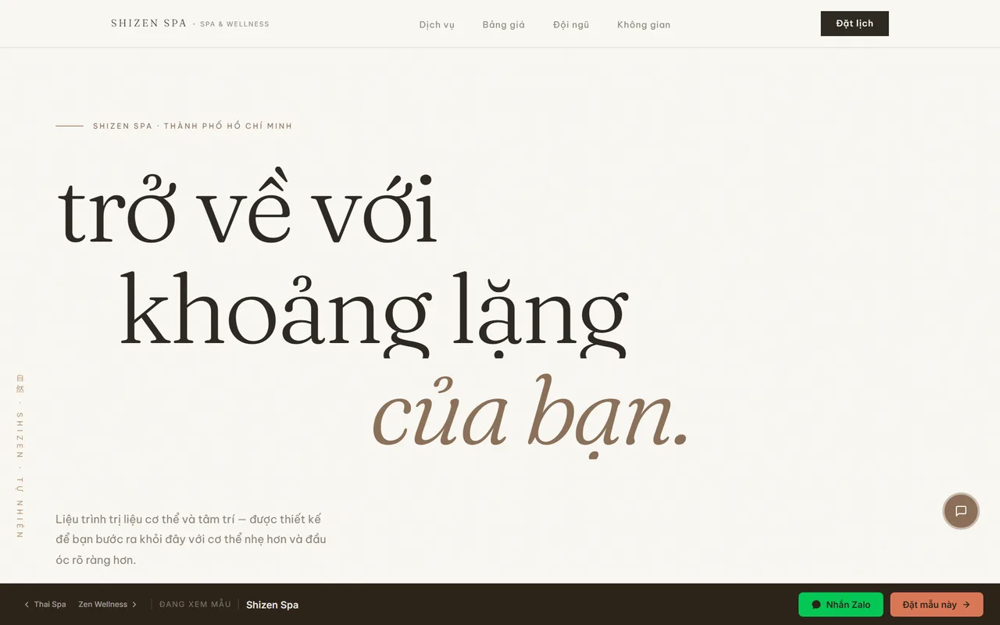
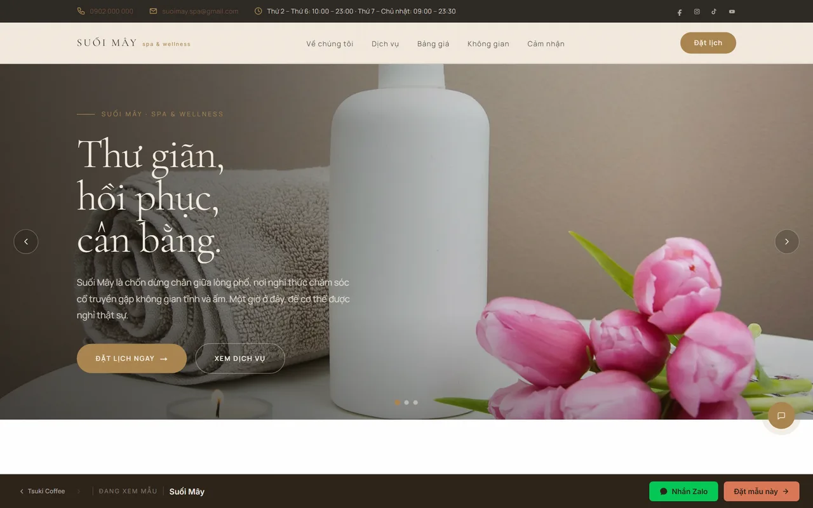
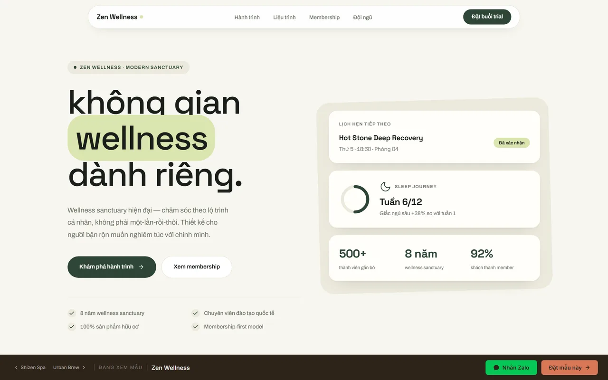
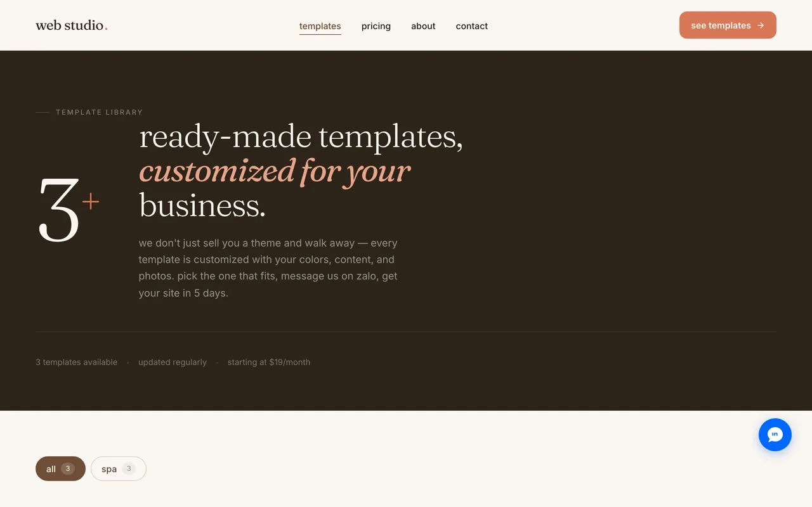

# Web Studio — a mini website platform for Vietnamese small businesses

**Web Studio** ("Little Web Shop") is a template-based landing page platform for small Vietnamese businesses — nail salons, spas, cafés, bakeries. A client picks a template, the studio customizes the content through a CMS, and the client's site is served on their own domain — all from a single Next.js codebase.

This repository is a **portfolio project**: it contains the full marketing site, nine production-quality landing page templates, an embedded CMS, and the order/delivery pipeline that would run the business end-to-end. All business data is fictional; photography is from Unsplash.

**Live demo:** [web-studio-chi.vercel.app](https://web-studio-chi.vercel.app)



## What's inside

- **Marketing site** (Vietnamese) — homepage, template catalog with industry filter, projects, about, contact
- **9 landing page templates**, each with its own deliberate art direction (see below)
- **Embedded Sanity Studio** at `/studio` for editing every page and template
- **Order pipeline** — contact form → rate-limited API → Sanity order document → email notification (Resend) → admin dashboard behind HTTP Basic Auth
- **Multi-tenant domain routing** — a customer's own domain is mapped through Vercel Edge Config and rewritten to their site in `proxy.ts`
- **SEO** — dynamic sitemap, robots, JSON-LD, per-page Open Graph images generated at the edge

## Templates

Each template locks in its own archetype — typography system, color world, signature interactions — so no two read as the same "house style". Browse any of them live at [`/templates/<slug>`](https://web-studio-chi.vercel.app/templates):

| Template | Business | Art direction |
|---|---|---|
| `shizen-spa` | Japanese-style spa | Bright Japandi — warm paper tones, headlines over imagery, mask reveals, hover-preview services |
| `suoi-may` | Premium day spa | Elegant western spa — copper/cream, layered-image intro, menu-style price list, dark booking panel |
| `zen-wellness` | Wellness studio | Calm-tech "wellness OS" — all-sans Space Grotesk, app-like widgets, floating pill nav |
| `thai-spa` | Thai massage | Classic symmetric formality — deep red and turmeric gold |
| `bach-thao` | Herbal spa | Vietnamese folk craft — dó-paper texture, herbal SVG illustrations |
| `lua-nail` | Nail studio | Editorial nail salon |
| `sweet-corner` | Bakery & café | Playful pastry shop — Pacifico + Nunito |
| `urban-brew` | City café | Urban coffee house |
| `tsuki-coffee` | Japanese café | Quiet Japanese coffee bar |

| [Shizen Spa](https://web-studio-chi.vercel.app/templates/shizen-spa) | [Suối Mây](https://web-studio-chi.vercel.app/templates/suoi-may) |
|---|---|
|  |  |
| [**Zen Wellness**](https://web-studio-chi.vercel.app/templates/zen-wellness) | [**Template catalog**](https://web-studio-chi.vercel.app/templates) |
|  |  |

## Architecture highlights

**Content falls back in three tiers.** Every template renders from `site.sections` (a client's customized content) → `template.sections` (the demo content edited in the CMS) → `DEFAULT_SECTIONS` (typed defaults in code, under `src/data/templates/`). The practical consequence: the entire site runs on a **completely empty Sanity dataset** — the CMS only ever overrides.

**Section types are semantic contracts, not layouts.** The same `servicesSection` data renders completely differently in each template; identity lives in components and CSS, data is shared. Adding a content type extends one shared library instead of forking schemas per template.

**The Studio seeds itself.** Custom Sanity inputs (`AutoSeedSectionsInput`, `AutoSeedSiteInput`) auto-fill a template's sections when an editor picks its component, and copy a template's content into a new client order — no manual JSON wrangling.

**One manifest drives everything.** `src/lib/templates.ts` is the single source of truth for the template list; the catalog, the contact form dropdown, static params, sitemap and the Studio dropdown all derive from it. Adding a template is one manifest line plus one registry entry.

**Client domains without redeploys.** `proxy.ts` looks up incoming hostnames in a Vercel Edge Config map and rewrites to the client's `/preview/[slug]` — new customer domains go live by writing one key through `/api/sync-domain`.

## Tech stack

| | |
|---|---|
| Framework | Next.js 16 (App Router, React Server Components) |
| Language | TypeScript |
| Styling | Tailwind CSS v4 + co-located CSS Modules, no UI library |
| CMS | Sanity (embedded Studio, `next-sanity`) |
| Email | Resend |
| Infra | Vercel (Edge Config for domain routing) |
| Testing | Vitest (`tests/`), Playwright |

## Getting started

```bash
pnpm install
```

Create a **free Sanity project** at [sanity.io/manage](https://sanity.io/manage), then copy `.env.example` to `.env.local` and fill in:

```bash
NEXT_PUBLIC_SANITY_PROJECT_ID=your-project-id
NEXT_PUBLIC_SANITY_DATASET=production
NEXT_PUBLIC_SANITY_API_VERSION=2026-05-17
```

The dataset can stay empty — every page and template renders from the typed defaults in `src/data/`. All other environment variables (Resend, GA, Edge Config, admin password) are optional and degrade gracefully when missing.

```bash
pnpm dev        # http://localhost:3000  (/studio for the CMS)
pnpm test       # unit tests (Vitest)
pnpm typecheck
pnpm build
```

## Project structure

```
src/
├── app/
│   ├── (site)/            # marketing pages (navbar + footer chrome)
│   ├── templates/[slug]/  # fullscreen template demos
│   ├── preview/[slug]/    # client site previews (domain-routed)
│   ├── admin/don-hang/    # order dashboard (Basic Auth)
│   ├── api/               # order creation, seeding, domain sync
│   └── studio/            # embedded Sanity Studio
├── components/
│   ├── sections/          # homepage sections
│   ├── templates/         # 9 templates, folder-based, co-located CSS Modules
│   └── layout/ ui/ preview/
├── data/                  # DEFAULT_* content — single source of truth for fallbacks
├── lib/                   # template manifest/registry, GROQ queries, helpers
├── sanity/                # client, schemas, custom Studio inputs
└── proxy.ts               # Basic Auth for /admin + customer-domain rewriting
```

---

Built by [Đức Ngô](https://github.com/ngohuynhducdev). UI copy is intentionally Vietnamese — the product's audience is Vietnamese small business owners.
