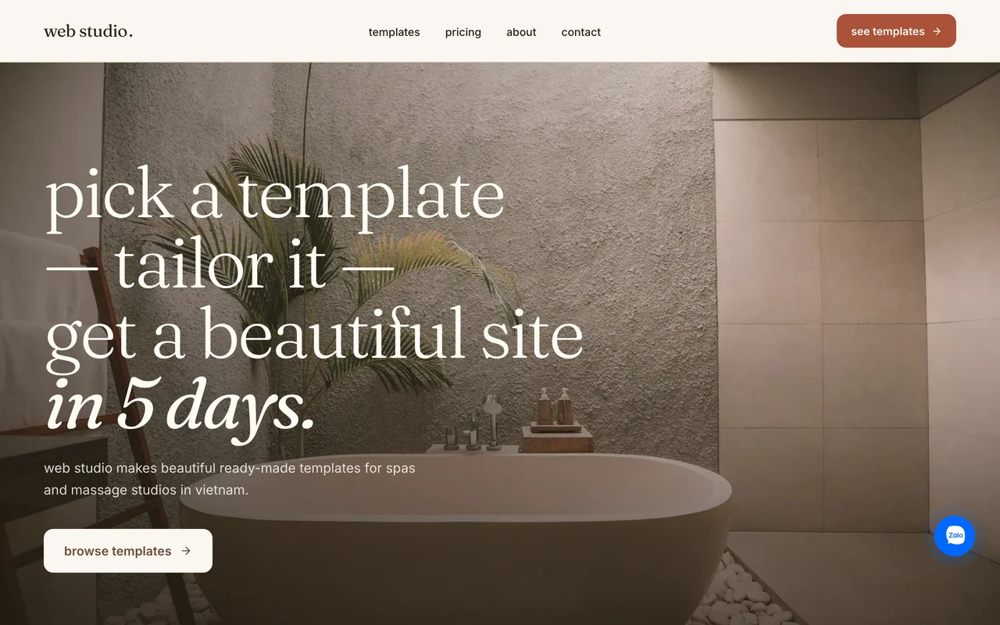
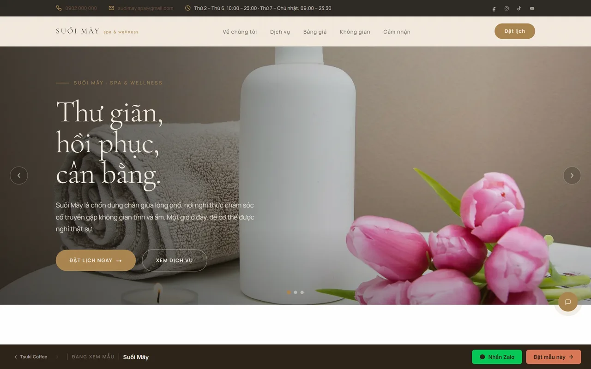
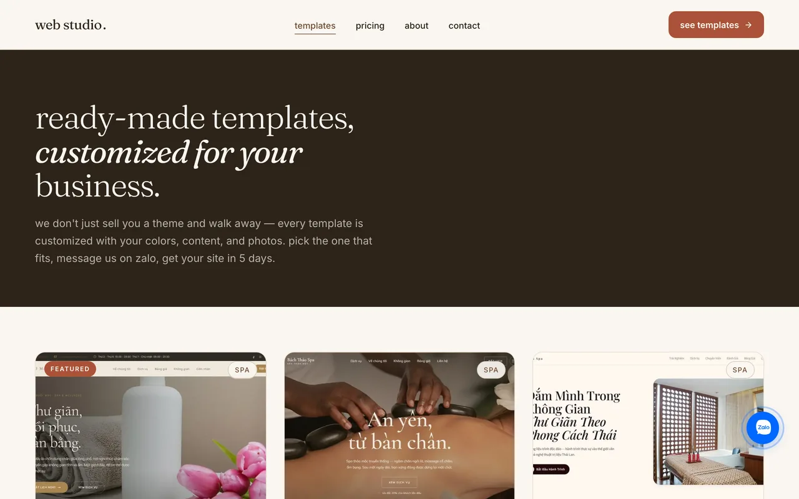
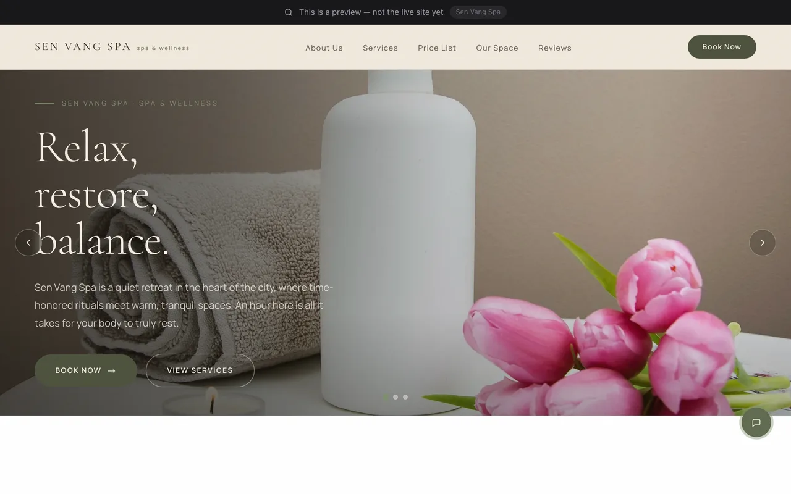
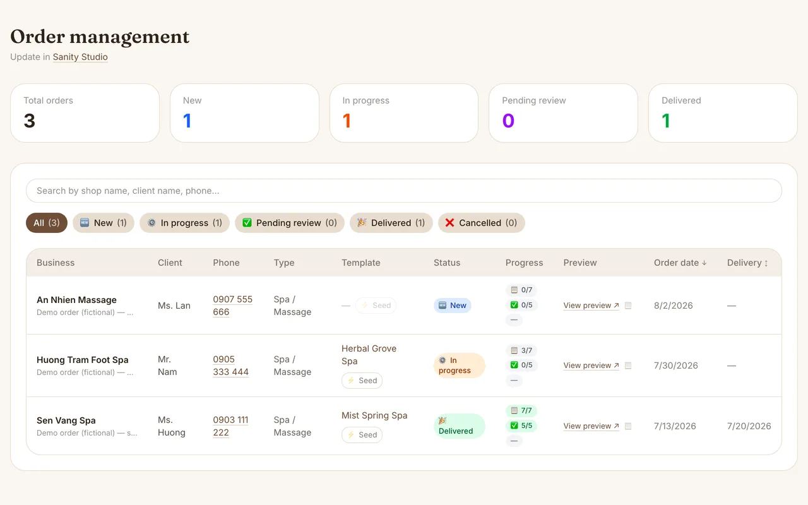

# Web Studio — a mini website platform for Vietnamese small businesses

**Web Studio** is a template-based landing page platform for small Vietnamese businesses. A client picks a template, the studio customizes the content through a CMS, and the client's site is served on their own domain — all from a single Next.js codebase. The catalog is spa-only for now — cafes, barbershops and other small shops are next — and the site's copy deliberately names only the industries that have a template today.

This repository is a **portfolio project**: it contains the full marketing site, three production-quality landing page templates, an embedded CMS, and the order/delivery pipeline that would run the business end-to-end. All business data is fictional; photography is from Unsplash.

**Live demo:** [web-studio-chi.vercel.app](https://web-studio-chi.vercel.app)



## What's inside

- **Marketing site** — homepage, template catalog, about, contact. The catalog carries an industry filter that hides itself while every template is a spa, rather than offering one pill that returns the whole list
- **3 landing page templates**, each with its own deliberate art direction (see below)
- **Embedded Sanity Studio** at `/studio` for editing every page and template
- **Order pipeline** — contact form → rate-limited API → Sanity order document → email notification (Resend) → admin dashboard behind HTTP Basic Auth
- **Multi-tenant domain routing** — a customer's own domain is mapped through Vercel Edge Config and rewritten to their site in `proxy.ts`
- **SEO** — dynamic sitemap, robots, JSON-LD, per-page Open Graph images generated at the edge

## Templates

Each template locks in its own archetype — typography system, color world, signature interactions — so no two read as the same "house style". Browse any of them live at [`/templates/<slug>`](https://web-studio-chi.vercel.app/templates):

| Template | Business | Art direction |
|---|---|---|
| `mist-spring-spa` | Premium day spa | Elegant western spa — copper/cream, layered-image intro, menu-style price list, dark booking panel |
| `thai-spa` | Thai massage | Classic symmetric formality — deep red and turmeric gold |
| `herbal-grove-spa` | Herbal spa | Vietnamese folk craft — handmade paper texture, herbal SVG illustrations |

| [Mist Spring Spa](https://web-studio-chi.vercel.app/templates/mist-spring-spa) | [Thai Spa](https://web-studio-chi.vercel.app/templates/thai-spa) |
|---|---|
|  |  |
| [Herbal Grove Spa](https://web-studio-chi.vercel.app/templates/herbal-grove-spa) | [Template catalog](https://web-studio-chi.vercel.app/templates) |
|  |  |

The dark bar along the bottom of each shot is the studio's preview chrome, not part of the delivered template.

## The pipeline behind the templates

The templates are the storefront; the rest of the project is the machinery that turns an order into a running site. Both ends of it are browsable.

**A delivered client site** — [`/preview/sen-vang-spa`](https://web-studio-chi.vercel.app/preview/sen-vang-spa). One `site` document: its own business name, its own brand colour threaded through the template's accent token, its own copy and contact details. The same Mist Spring Spa template as the catalog demo, rendered for a different business. The banner across the top is the pre-launch state; on the client's own domain `proxy.ts` sets a header that hides it.

**The order dashboard** — `/admin/orders`, behind HTTP Basic Auth, so the screenshot stands in for it. Orders arrive from the contact form, carry an intake and QA checklist, and link to their own preview.

| Client site | Order dashboard |
|---|---|
|  |  |

The three orders behind these are fictional, created by `scripts/seed-demo-sites.ts` — one delivered, one mid-build, one still unassigned, so the dashboard shows the states it is built for.

## Architecture highlights

**Content falls back in three tiers.** Every template renders from `site.sections` (a client's customized content) → `template.sections` (the demo content edited in the CMS) → `DEFAULT_SECTIONS` (typed defaults in code, under `src/data/templates/`). The practical consequence: the entire site runs on a **completely empty Sanity dataset** — the CMS only ever overrides.

**Section types are semantic contracts, not layouts.** The same `servicesSection` data renders completely differently in each template; identity lives in components and CSS, data is shared. Adding a content type extends one shared library instead of forking schemas per template.

**The Studio seeds itself.** Custom Sanity inputs (`AutoSeedSectionsInput`, `AutoSeedSiteInput`) auto-fill a template's sections when an editor picks its component, and copy a template's content into a new client order — no manual JSON wrangling.

**One manifest drives everything.** `src/lib/templates.ts` is the single source of truth for the template list; the catalog, the contact form dropdown, static params, sitemap and the Studio dropdown all derive from it. Adding a template is one manifest line plus one registry entry.

**Client domains without redeploys.** `proxy.ts` looks up incoming hostnames in a Vercel Edge Config map and rewrites to the client's `/preview/[slug]` — new customer domains go live by writing one key through `/api/sync-domain`.

## Tech stack

| | |
|---|---|
| Framework | Next.js 16 (App Router, React Server Components) |
| Language | TypeScript |
| Styling | Tailwind CSS v4 + co-located CSS Modules, no UI library |
| CMS | Sanity (embedded Studio, `next-sanity`) |
| Email | Resend |
| Infra | Vercel (Edge Config for domain routing) |
| Testing | Vitest (`tests/`), Playwright |

## Getting started

```bash
pnpm install
```

Create a **free Sanity project** at [sanity.io/manage](https://sanity.io/manage), then copy `.env.example` to `.env.local` and fill in:

```bash
NEXT_PUBLIC_SANITY_PROJECT_ID=your-project-id
NEXT_PUBLIC_SANITY_DATASET=production
NEXT_PUBLIC_SANITY_API_VERSION=2026-05-17
```

The dataset can stay empty — every page and template renders from the typed defaults in `src/data/`. All other environment variables (Resend, GA, Edge Config, admin password) are optional and degrade gracefully when missing.

```bash
pnpm dev        # http://localhost:3000  (/studio for the CMS)
pnpm lint
pnpm typecheck
pnpm test       # unit tests (Vitest)
pnpm test:e2e   # Playwright, starts its own server on :3100
pnpm build
```

## Project structure

```
src/
├── app/
│   ├── (site)/            # marketing pages (navbar + footer chrome)
│   ├── templates/[slug]/  # fullscreen template demos
│   ├── preview/[slug]/    # client site previews (domain-routed)
│   ├── admin/orders/      # order dashboard (Basic Auth)
│   ├── api/               # order creation, seeding, domain sync
│   └── studio/            # embedded Sanity Studio
├── components/
│   ├── sections/          # homepage sections
│   ├── templates/         # 3 templates, folder-based, co-located CSS Modules
│   └── layout/ ui/ preview/
├── data/                  # DEFAULT_* content — single source of truth for fallbacks
├── lib/                   # template manifest/registry, GROQ queries, helpers
├── sanity/                # client, schemas, custom Studio inputs
└── proxy.ts               # Basic Auth for /admin + customer-domain rewriting
```

## Security posture and known limits

`/admin` and `/api/admin/*` sit behind HTTP Basic Auth with a constant-time password comparison that fails closed when `ADMIN_PASSWORD` is unset; `/api/seed-order` takes a shared secret and `/api/sync-domain` verifies the Sanity webhook HMAC. Baseline security headers (`frame-ancestors`, `nosniff`, `Referrer-Policy`, HSTS, `Permissions-Policy`) are set in `next.config.ts`, which documents why a full CSP is not — Next's inline bootstrap and the embedded Studio would need per-request nonces, and those opt every page out of static rendering.

The order form's rate limit (3/IP/hour) is an in-memory counter, so it is scoped to a single serverless instance and resets on cold starts. It stops accidental double-submits and casual bursts, not a determined attacker. Making it real means a shared store keyed by IP — the swap is confined to `isRateLimited` in `src/app/api/create-order/route.ts`.

`robots.txt` and `sitemap.xml` are built from a single `NEXT_PUBLIC_SITE_URL`, so a client site served on its own domain answers with the studio's sitemap rather than its own. Harmless while the domain map is empty; the fix is to derive the origin from the request host in `robots.ts` and `sitemap.ts`, the same way `proxy.ts` already reads it.

---

Built by [Duc Ngo](https://github.com/ngohuynhducdev). UI copy is in English; the product's audience is Vietnamese small business owners.
